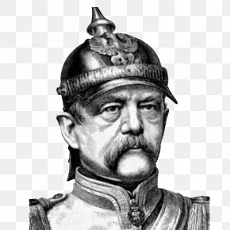

# Welcome to Your Student Dormitory Hub!

As a resident of Bismarckstraße, we're thrilled to have you as part of our community. This website serves as your one-stop hub for essential information and resources to make your stay here enjoyable and hassle-free.

## Explore Your Dormitory Life

Here, you'll find a collection of pages designed to enrich your experience and provide you with valuable insights. Let's take a quick tour of what each page offers:

- **[Events Page](events.md)**: Stay updated on the exciting events happening in our bar and connect with fellow residents. Don't miss out on the fun!

- **[Wi-Fi Page](wifi.md)**: Get all the details you need to set up your Wi-Fi and stay connected. We've got you covered!

- **[Help Page](help.md)**: Need assistance? Find out who to reach out to and get helpful tips on getting support within the dormitory.

- **[Learn German Page](german.md)**: Embrace the local culture by learning the language. Discover practical language learning tips and advice.

- **[Useful Links Page](links.md)**: Access important links for internet information, contacts, and more. Your go-to resource for essential resources.

## Your Comfort and Convenience

We want your stay at Bismarckstraße to be comfortable and memorable. These pages are here to assist you in navigating dormitory life, connecting with your fellow residents, and making the most of your time here.

Remember, you're not alone on this journey. Feel free to reach out to us if you have any questions or need assistance. Our aim is to make your stay here pleasant and enriching.

Welcome to your home away from home!

