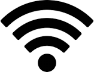

# Internet Access Information

Getting connected to the internet is crucial. Follow these steps to set up your Wi-Fi:

1. Refer to the [instructions for internet access](https://stw-bonn.de/en/support/firststeps/start).

2. Ensure you have your rental contract ready and own a router. We recommend models found [here](https://stw-bonn.de/en/support/internet/wlan_basic).

3. Consider reaching out to your neighbors for help with internet setup. You might make a new friend! ;-)

4. For additional assistance, contact our internet mentors. You can find their details by the front door.

Stay connected and enjoy your time at the dorm!

